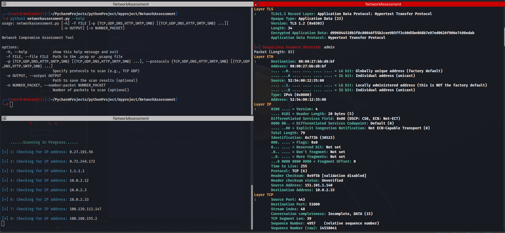

# NetworkAssessment: Network Compromise Assessment Tool


The Network Compromise Assessment Tool is designed to analyze pcap files to detect potential suspicious network traffic. This tool focuses on spotting abnormal activities in the network traffic and searching for suspicious keywords.



## Features

- **DNS Tunneling Detection**: Identifies potential covert communication channels over DNS.
- **SSH Tunneling Detection**: Spots signs of SSH sessions which may be used to bypass network restrictions or cloak malicious activities.
- **TCP Session Hijacking Identification**: Monitors for suspicious TCP sessions which might indicate unauthorized takeovers.
- **Various Attack Signatures**: Recognizes indicators of SYN flood, UDP flood, Slowloris, SMB attacks, and more.
- **Suspicious Keyword Search**: Actively scans the network traffic for user-defined keywords that could be indicative of malicious intent or sensitive data leakage.
- **Protocol-Specific Scanning**: Allows users to specify which protocols to monitor, ensuring focused and efficient analysis.
- **Output Logging**: Provides an option to save detailed analysis results to a file for further investigation or record-keeping.
- **IPv6 Fragmentation Attack Detection**: Spots potential attempts to exploit the fragmentation mechanism in IPv6 for nefarious purposes.
- **User-Friendly Display**: Color-coded outputs and progress indicators enhance readability and user experience.

The tool is not just limited to the aforementioned features. With contributions from the community, its detection capabilities can continuously evolve and adapt to the latest threat landscape.


## Requirements

- Python 3.x
- scapy
- argparse
- pyshark
- colorama

## Installation

1. Clone the repository:

   ```shell
   git clone https://github.com/HalilDeniz/NetworkAssessment.git
   ```

2. Navigate to the project directory:

   ```shell
   cd NetworkAssessment
   ```

3. Install the required dependencies:

   ```shell
   pip install -r requirements.txt
   ```

## Usage

```shell
python3 networkassessment.py [-h] -f FILE [-p {TCP,UDP,DNS,HTTP,SMTP,SMB} [{TCP,UDP,DNS,HTTP,SMTP,SMB} ...]]
                            [-o OUTPUT] [-n NUMBER_PACKET]
```
- `-f` or `--file`: Path to the `.pcap` or `.pcapng` file you intend to analyze. This is a mandatory field, and the assessment will be based on the data within this file.
- `-p` or `--protocols`: Protocols you specifically want to scan. Multiple protocols can be mentioned. Available choices are: "TCP", "UDP", "DNS", "HTTP", "SMTP", "SMB".
- `-o` or `--output`: Path to save the scan results. This is optional. If provided, the findings will be saved in the specified file.
- `-n` or `--number-packet`: Number of packets you wish to scan from the provided file. This is optional. If not specified, the tool will scan all packets in the file.

In the above example, the tool will analyze the first 1000 packets of the `sample.pcap` file, focusing on the TCP and UDP protocols, and will then save the results to `output.txt`.

## Contributing
Contributions are welcome! If you find any issues or have suggestions for improvements, feel free to open an issue or submit a pull request.

## Contact
If you have any questions, comments, or suggestions about Dosinator, please feel free to contact me:

- LinkedIn: [Halil Ibrahim Deniz](https://www.linkedin.com/in/halil-ibrahim-deniz/)
- TryHackMe: [Halilovic](https://tryhackme.com/p/halilovic)
- Instagram: [deniz.halil333](https://www.instagram.com/deniz.halil333/)
- YouTube: [Halil Deniz](https://www.youtube.com/c/HalilDeniz)
- Email: halildeniz313@gmail.com

## About the Original Author

NetworkAssesment is a fork of the original tool called Network_Assessment, which was created by [alperenugurlu](https://github.com/alperenugurlu).
I would like to express my gratitude to Alperen Uğurlu for the inspiration and foundation provided by the original tool. Without his work, this updated version would not have been possible.
If you would like to learn more about the original tool, you can visit the [Network_Assessment repository](https://github.com/alperenugurlu/Network_Assessment).


## License
This project is licensed under the MIT License. See the [LICENSE](LICENSE) file for more details.

## 💰 You can help me by Donating
  Thank you for considering supporting me! Your support enables me to dedicate more time and effort to creating useful tools like DNSWatch and developing new projects. By contributing, you're not only helping me improve existing tools but also inspiring new ideas and innovations. Your support plays a vital role in the growth of this project and future endeavors. Together, let's continue building and learning. Thank you!"<br>
  [](https://buymeacoffee.com/halildeniz) 
  [](https://patreon.com/denizhalil) 

  
